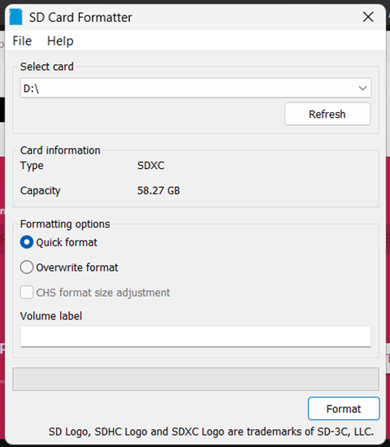
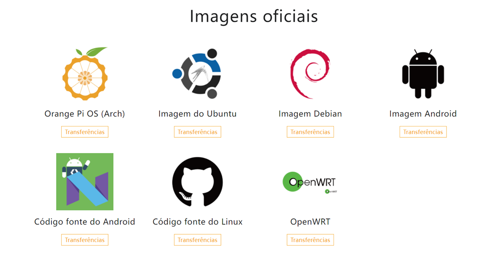
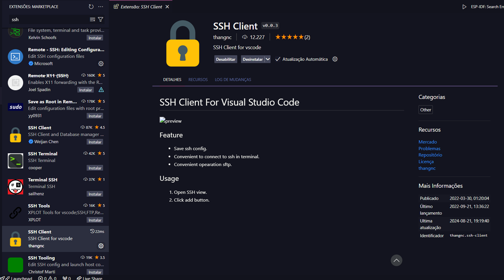
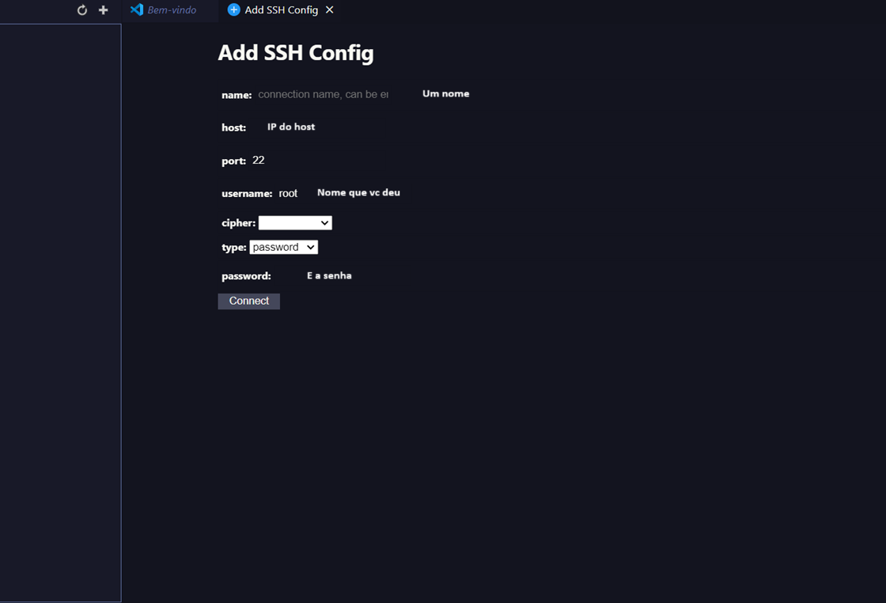

# _Configuração de Ambiente_


---

## Sumário

- [Histórico de Versão](#histórico-de-versão)
- [Resumo](#resumo)
- [Requisitos](#requisitos)
- [Informações Adicionais](#informações-adicionais)
    - [Instalação SDCard](#instalação-sdcard)
    - [Instalação BalenaEtcher](#Iinstalação-balenaEtcher)
    - [Instalação Imagem Orange Pi](#instalação-imagem-orange-pi)
    - [Configurando SSH para acessar via rede](#configurando-ssh-para-acessar-via-rede)
- [Informações](#informações)

## Histórico de Versão

| Versão | Data       | Autor       | Descrição         |
|--------|------------|-------------|-------------------|
| 1.0.0  | 25/09/2024 | Adenilton R | Início do Projeto |

## Resumo

Este documento visa fornecer orientações para a instalação dos softwares necessários, para poder rodar imagens do sistema operacioanal. Cada exemplo de projeto será detalhadamente abordado, fornecendo instruções passo a passo para execução nos respectivos softwares mencionados.

## Requisitos

Softwares a serem instalados:

📥 [BalenaEtcher](https://etcher.balena.io/#download-etcher)

📥 [Orange Pi Zero 3](http://www.orangepi.org/html/hardWare/computerAndMicrocontrollers/service-and-support/Orange-Pi-Zero-3.html)

📥 [SDCard](https://www.sdcard.org/downloads/formatter/)

## Informações Adicionais

Este documento apresentará os passos detalhados para a instalação e configuração do ambiente, incluindo os softwares necessários.

### Instalação SDCard

Para baixar software 📥 [**`SDCard`**](https://www.sdcard.org/downloads/formatter/). Depois de instalar clique para abrir e faça a formatação



### Instalação BalenaEtcher

Para baixar software 📥 [**`BalenaEtcher`**](https://etcher.balena.io/#download-etcher). Depois de instalar clique para abrir, `Flash from file` para adicionar a imagens, `Select target` para escolher o cartão SD, toma cuidado para não escolher a unidade errada e `Flash!` para instalar a imagem:


### Instalação Imagem Orange Pi

Para baixar imagem 📥  [**`Orange Pi Zero 3`**](http://www.orangepi.org/html/hardWare/computerAndMicrocontrollers/service-and-support/Orange-Pi-Zero-3.html), escolha conforme sua necessidade:



### Configurando SSH para acessar via rede:

Conecte no wi-fi do Orange Pi, depois abilite SSH, em seguida digite comando abaixo para achar IP:

```basic
ifconfig
```

Para conectar via SSH com seu PC e o Orange Pi, abra um terminal:

```basic
ssh orangepi@192.100.10.100
```

Senha: 

```basic
orangepi
```

Para atualizar os Orange Pi:

```basic
sudo apt-get update
```

Instalar SSH:

```basic
sudo apt-get install openssh-server
```

Instalar vim:

```basic
sudo apt-get install vim
```

Para conectar via ssh no vscode na sua máquina, na extensões do vscode baixe `SSH Client`, [link de vídeo para referençia](https://www.youtube.com/watch?v=aJlmlH-I_c4):



Configure seu ssh:



## Informações

| Software                 | Versão     |
|--------------------------|------------|
| BalenaEtcher             | v6.20      |
| Orange Pi Zero 3 desktop | 10/07/2023 |
| SDCard                   | v5.0.2     |