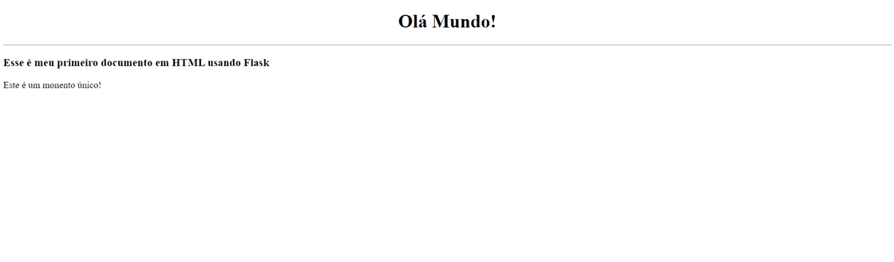

# _Intrudução de Flask_


---

## Sumário

- [Histórico de Versão](#histórico-de-versão)
- [Introdução](#introdução)
    - [Como o Flask Funciona](#como-o-flask-funciona)
- [Resumo](#resumo)
- [Objetivo](#objetivo)
- [Estrutura do Projeto](#estrutura-do-projeto)
- [Links de Estudo](#links-de-estudo)
- [Instale Git](#instale-git)
    - [Configuração Básica do Git](#configuração-básica-do-git)
- [Ambiente Virtual com venv no Orange Pi](#ambiente-virtual-com-venv-no-orange-pi)
    - [1. Instale o Python](#1.-instale-o-python)
    - [2. Crie um Ambiente Virtual](#2.-crie-um-ambiente-virtual)
    - [3. Ative o Ambiente Virtual](#3.-ative-o-ambiente-virtual)
    - [4. Instale Pacotes](#4.-instale-pacotes)
    - [5. Desative o Ambiente Virtual](#5.-desative-o-ambiente-virtual)
    - [6. Remover o Ambiente Virtual](#6.-remover-o-ambiente-virtual)
    - [Notas Adicionais](#notas-adicionais)
- [Instalando pacotes do python3](#instalando-pacotes-do-python3)
    - [Pacotes Python3](#pacotes-python3)
    - [Estrutura do Projeto](#estrutura-do-projeto)
- [Informações](#informações)

## Histórico de versão

| Versão | Data       | Autor       | Descrição         |
|--------|------------|-------------|-------------------|
| 1.0.0  | 25/09/2024 | Adenilton R | Início do Projeto |

## Introdução

[**`Flask é um micro framework`**](https://flask.palletsprojects.com/en/3.0.x/) web escrito em Python que facilita a criação de aplicativos web de forma simples e rápida. Apesar de ser leve e minimalista, ele é altamente extensível, permitindo que você adicione funcionalidades conforme necessário.

### Como o Flask Funciona:

- O Flask usa um servidor web embutido para rodar suas aplicações, permitindo que você veja as mudanças instantaneamente no navegador.
- Ele segue o padrão MVC (Model-View-Controller), onde você define as rotas (URLs) da sua aplicação, e para cada rota você pode associar uma função Python que define o que deve ser mostrado no navegador.
- A principal vantagem do Flask é a sua simplicidade, ideal para projetos pequenos e médios.

## Resumo

Este é um projeto Python que utiliza a biblioteca Flask para criar uma página no navegador. O objetivo é ensinar a configurar o ambiente no Orange Pi Zero 3, instalar os pacotes necessários e rodar uma aplicação simples de "Olá Mundo".

## Objetivo

O objetivo deste projeto é guiar a configuração do ambiente no Orange Pi Zero 3, instalando os pacotes essenciais e rodando uma aplicação Flask básica que exibe uma página no navegador.

## Estrutura do Projeto

Aqui está uma visão geral da estrutura básica do projeto:

meu_projeto/

├── README.md

├── main.py

├── templates/

│ ├── homepage.html

│ └── ...

├── static/

│ ├── img/

│ │├── imagens.png

│ │└── ...

└── ...

- `README.md`: Este arquivo que você está lendo agora.
- `main.py`: O arquivo principal do projeto.
- `templates/`: Uma pasta que contém as paginas HTML.
- `static/img/`: Uma pasta que contém arquivos de imagens.

## Links de Estudo

[Flask](https://flask.palletsprojects.com/en/3.0.x/)

[Documentação Orange Pi Zero 3](http://www.orangepi.org/html/hardWare/computerAndMicrocontrollers/details/Orange-Pi-Zero-3.html)

[Esquemático Orange Pi Zero 3](https://drive.google.com/file/d/1GelRJz-6Dg4i_EQ1SwrfHeqfLOPw9kdO/view)

[OrangePi-Schematic of ZERO3.pdf](Docs/OrangePi-Schematic%20of%20ZERO3.pdf)

## Instale Git

Instale o Git com o seguinte comando:

```basic
sudo apt install git -y
```

Para garantir que o Git foi instalado corretamente, verifique a versão instalada com:

```basic
git --version
```

### Configuração Básica do Git

Após a instalação, é importante configurar o Git com seu nome de usuário e e-mail, pois essas informações serão usadas em seus commits.

Execute os comandos abaixo, substituindo `"Seu Nome"` e `"seuemail@exemplo.com"` pelos seus dados:

```basic
git config --global user.name "Seu Nome"
git config --global user.email "seuemail@exemplo.com"
```

## Ambiente Virtual com venv no Orange Pi

Para criar e gerenciar um ambiente virtual usando `venv` no Orange Pi, siga os passos abaixo:

### **1. Instale o Python**

Certifique-se de que o Python está instalado no seu Orange Pi. A maioria das distribuições do Orange Pi já vem com o Python pré-instalado. Caso precise instalar ou atualizar, execute, v3.11.2:

```bash
sudo apt update
sudo apt install python3 python3-venv
```

### 2. Crie um Ambiente Virtual

1. **Abra um Terminal no Orange Pi.**
2. Navegue até Documents:
    
    ```basic
    cd Documents
    ```
    
3. Executar o Comando para Criar a Pasta:
    
    ```basic
    mkdir Projetos
    ```
    
4. Navegue até Projetos e crie a pasta com nome do seu projeto:
    
    ```basic
    cd Projetos
    ```
    
    ```basic
    mkdir Flask-Interface
    ```
    
5. **Execute o Comando para Criar o Ambiente Virtual:**
    - Substitua `nome_do_seu_ambiente` pelo nome desejado para o seu ambiente virtual, nome do meu ambiente é `flask-interface`.
    
    ```bash
    python3 -m venv nome_do_seu_ambiente
    ```
    
    Isso criará uma pasta chamada `nome_do_seu_ambiente` contendo o ambiente virtual.
    

### 3. Ative o Ambiente Virtual

Para ativar o ambiente virtual, execute o comando apropriado para o seu sistema:

```bash
source flask-interface/bin/activate
```

Após a ativação, você verá o nome do ambiente virtual aparecer no prompt do terminal, indicando que você está trabalhando dentro do ambiente virtual.

### 4. Instale Pacotes

Com o ambiente virtual ativado, você pode instalar pacotes usando `pip`. Por exemplo:

```bash
pip install nome_do_pacote
```

### 5. Desative o Ambiente Virtual

Para desativar o ambiente virtual e retornar ao ambiente global do Python, execute:

```bash
deactivate
```

### 6. Remover o Ambiente Virtual

Se você precisar excluir o ambiente virtual, basta remover a pasta que foi criada. No exemplo acima, você pode excluir a pasta `nome_do_seu_ambiente`:

```bash
rm -rf nome_do_seu_ambiente
```

### Notas Adicionais

- **Gerenciamento de Pacotes:**
    - Use `pip list` para listar pacotes instalados e `pip freeze` para gerar um arquivo `requirements.txt` com as dependências do projeto.
- **Arquivo `requirements.txt`:**
    - Para gerar um arquivo `requirements.txt`, execute:
        
        ```bash
        pip freeze > requirements.txt
        ```
        
    - Para instalar pacotes a partir de um `requirements.txt`, use:
        
        ```bash
        pip install -r requirements.txt
        ```
        

## Instalando pacotes do python3

Para ativar o ambiente virtual, execute o comando apropriado para o seu sistema:

```bash
source flask-interface/bin/activate
```

Para desativar o ambiente virtual e retornar ao ambiente global do Python, execute:

```bash
deactivate
```

### Pacotes Python3

[Flask](https://flask.palletsprojects.com/en/3.0.x/), v3.0.3

```bash
pip install Flask
```

### Estrutura do Projeto

dentro do caminho crie as pasta para o projeto:

```basic
cd Documents/Projetos/Flask-Interface
```

Pasta templates:

```basic
mkdir templates
```

Cliar arquivos .py

```basic
vim main.py
```

Pasta static/img:

```basic
mkdir static
```

```basic
cd static
```

```basic
mkdir img
```

Cliar arquivos main.py

```basic
vim main.py
```

Cliar arquivos README.md

```basic
vim README.md
```



Código main.py:

```python
'''
 * NOME: Adenilton Ribeiro
 * DATA: 13/09/2024
 * PROJETO: Flask com Orange Pi Zero 3
 * VERSAO: 01
 * DESCRICAO: - feat: Criar página  de exemplos.
 * LINKS: 
'''

from flask import Flask, render_template, request

app = Flask(__name__)

@app.route("/")
def homepage():

    return render_template("homepage.html")

if __name__ == '__main__':
    app.run(host='0.0.0.0', debug=True)
```

Código HTML - homepage:

```html
<!DOCTYPE html>
<html lang="pt-br">
<head>
    <meta charset="UTF-8">
    <meta name="viewport" content="width=device-width, initial-scale=1.0">
    <title>Homepage</title>
</head>
<body>
    <h1><center>Olá Mundo!</h1>
    <hr>
    <h3>Esse é meu primeiro documento em HTML usando Flask</h3>
    <p>Este é um monento único!</p>
</body>
</html>
```

Para pode rodar o código, digite os seguintes comandos:

```basic
python3 main.py
```

Para poder fechar a aplicação só dar **`Ctrl + c`**:

## Informações

| Software         | Versão  |
|------------------|---------|
| Python           | v3.11.2 |
| Flask            | v3.0.3  |