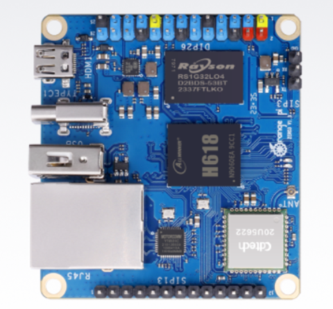
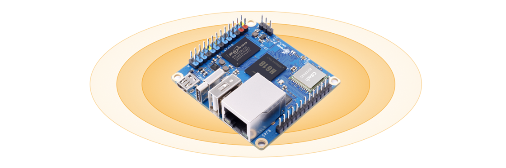
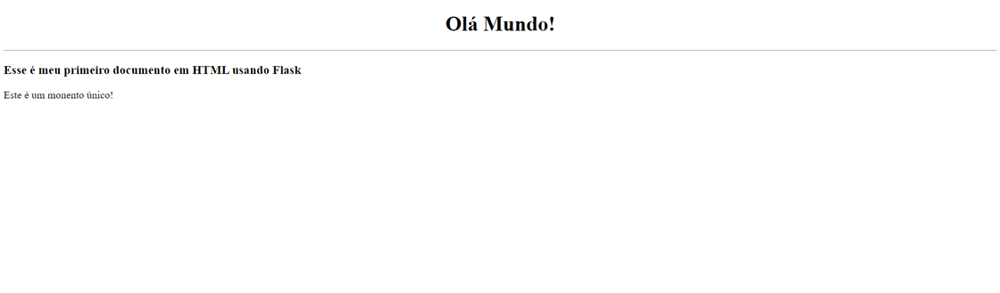

# _Orange Pi Zero 3_

---

## Sumário

- [Histórico de Versão](#histórico-de-versão)
- [Resumo](#resumo)
- [Objetivo](#Objetivo)
- [Requisitos](#requisitos)
- [Orange Pi Zero 3](#orange-pi-zero-3)
- [Informações Adicionais](#informações-adicionais)
    - [Configuração do Ambiente](#configuração-do-ambiente)
    - [Intrudução de Flask](#intrudução-de-flask)

## Histórico de Versão

| Versão | Data       | Autor       | Descrição         |
|--------|------------|-------------|-------------------|
| 1.0.0  | 26/09/2024 | Adenilton R | Início do Projeto |

## Resumo

Projeto destinado a configurar o ambiente do Orange Pi Zero 3 e desenvolver diversos projetos de Linux embarcado. Inclui desde a configuração inicial até a criação de aplicações embarcadas com foco em automação, controle e comunicação com periféricos.

## Objetivo

O objetivo é fornecer um guia completo de configuração do Orange Pi Zero 3, preparando o dispositivo para projetos de Linux embarcado, além de implementar soluções práticas de controle e automação, utilizando tecnologias como SSH, Flask e GPIOs.

## Requisitos

- **Hardware:**
    - Orange Pi Zero 3
    - Fonte de alimentação compatível
    - Cartão microSD (classe 10 ou superior)
    - Cabo Ethernet ou adaptador Wi-Fi
    - PC para acesso remoto via SSH
- **Software:**
    - Sistema operacional Armbian (ou outro compatível)
    - Git para controle de versão
    - Python 3 e Flask para desenvolvimento de interfaces web
    - `bash-completion`, `ssh` e outras ferramentas essenciais
- **Outros Pré-requisitos:**
    - Conhecimento básico de Linux embarcado
    - Acesso à internet para atualizações e downloads de pacotes

## Orange Pi Zero 3

O [**`Orange Pi Zero 3`**](http://www.orangepi.org/html/hardWare/computerAndMicrocontrollers/details/Orange-Pi-Zero-3.html) é equipado com o processador Allwinner H618, um quad-core Cortex-A53, e GPU Arm Mali-G31 MP2, oferecendo suporte a gráficos como OpenGL ES e Vulkan. Ele tem opções de memória que variam de 1 GB a 4 GB e suporta decodificação de vários formatos de vídeo, com saída Micro-HDMI para exibição 4K. Além disso, a placa pode ser expandida com uma variedade de funções como fones de ouvido, TVout, USB 2.0 e recepção IR, usando portas de expansão de 13 e 26 pinos, aumentando as capacidades de conectividade e interface.

**Informações Técnicas:**

- **`CPU:`** Processador Allwinner H618 Quad-core Cortex-A53 1.5GHz;
- **`GPU:`** Mali G31 MP2, suporta OpenGL ES 1.0/2.0/3.2, OpenCL 2.0, Vulkan 1.1;
- **`Memória:`** Memória LPDDR4 disponível em 1 GB, 1.5 GB, 2 GB, ou 4 GB;
- **`Armazenamento a bordo:`** 16 MB de memória flash SPI;
- **`Gerenciamento de energia:`** AXP313A;
- **`Wi-Fi + Bluetooth integrado:`** Suporta WiFi5 e Bluetooth 5.0;
- **`Rede:`** Interface Ethernet 10M/100M/1000M;
- **`Entrada/saída de áudio:`** Porta de expansão de 13 pinos suporta saída de 2 canais e entrada de 1 canal;
- **`Saída de vídeo:`**
    - Micro HDMI até 4K a 60 fps;
    - Saída de TV: 13 pinos suporta saída de TV CVBS de 1 canal;
- **`UART:`** UART de depuração de 3 pinos;
- **`USB:`** USB 2.0 x3 (dois dos quais vêm da placa de expansão);
- **`Interface de cartão SD:`** Interface de cartão Micro SD;
- **`Interface de expansão:`**
    - Interface GPIO de 26 pinos;
    - Interface GPIO de 13 pinos;
- **`Entrada de energia:`** 5V3A, conector tipo C;
- **`Sistema Operacional suportado**:` Android 12 TV, Debian 11, Debian 12, Ubuntu 22.04, Ubuntu 20.04;
- **`Dimensões do PCB:`** 50 mm x 55 mm;

## Informações Adicionais

### Configuração do Ambiente

Para obter mais informações sobre o projeto, clique no [**link**](https://github.com/AdeniltonR/Primeiros-passos-Orange-Pi-Zero3/tree/main/Config-ambiente) a seguir.

### Intrudução de Flask

Para obter mais informações sobre o projeto, clique no [**link**](https://github.com/AdeniltonR/Primeiros-passos-Orange-Pi-Zero3/tree/main/Flask-interface) a seguir.

